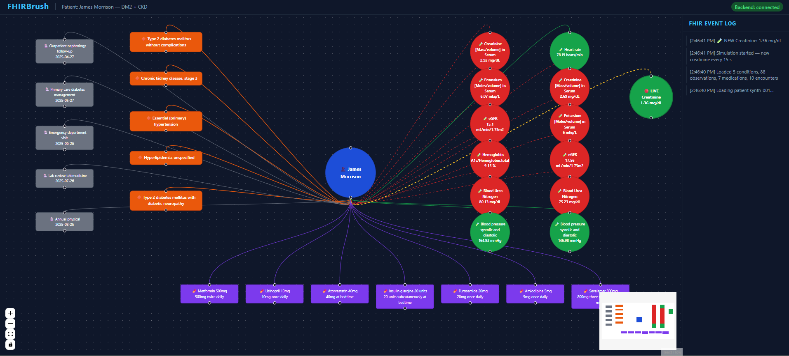

# FHIRBrush



## Phase 1: Rapid Alignment (12:08 → 12:45) — *Together, 37 minutes*

You've already done a lot of the conceptual alignment in this conversation, so this phase is short. The one thing you genuinely need Meera for right now, before you touch code, is to lock in the clinical scenario and get the exact LOINC codes from her. Ask her specifically: what 4-5 lab values tell the most dramatic story for a diabetic kidney disease patient? She should give you the LOINC codes (creatinine is `2160-0`, potassium is `2823-3` — she'll know the rest), the normal ranges, and the threshold values where Claude should "react" visually. Write these down. They go directly into the system prompt and the simulation script.

While she's doing that, you spend this phase spinning up the repo, initializing the React app with React Flow, and setting up your FastAPI or Express backend. By 12:45 you should have a repo with a running frontend and backend that talk to each other, even if they do nothing interesting yet.

### Run Phase 1 (your part)

**Backend (FastAPI)** — in one terminal:
```bash
cd backend
pip install -r requirements.txt
uvicorn main:app --reload --port 8000
```

**Frontend (React + React Flow)** — in another terminal:
```bash
cd frontend
npm install
npm run dev
```

Open http://localhost:5173. The header should show **Backend: connected** when the API is reachable. You’ll see a minimal React Flow canvas (two placeholder nodes). That’s the Phase 1 target.

---

## Phase 2: Data Pipeline (12:45 → 2:15) — *Parallel, 90 minutes*

This is your most important phase and you're doing it mostly solo while Meera writes the Claude prompt.

Your goal is ruthlessly simple: get real FHIR data from the HAPI server appearing as nodes on the React Flow canvas. Don't worry about Claude yet. Don't worry about beauty yet. Just get the data flowing. Fetch the patient's Conditions, Observations, and MedicationRequests in parallel, map each resource type to a node type, and render them on screen. Then get the WebSocket simulation loop running so a new creatinine Observation appears every 15 seconds and a new node or updated node shows up on the canvas. When that loop is visible and working, you have the heartbeat of the entire project.

Meera in parallel is writing the Claude system prompt in a simple text file or Notion doc. Her prompt should explain to Claude what each FHIR resource type means clinically, include the normal ranges she gave you, and specify the exact JSON output shape you need — highlight which nodes, draw which relationships, and generate one narrative sentence. This is genuinely her most valuable contribution to the build and it will take her the full 90 minutes to do it well.

---

## Phase 3: Claude Integration (2:15 → 3:45) — *Together first, then split, 90 minutes*

Spend the first 30 minutes together getting Claude wired in. Take Meera's system prompt, send a single hardcoded FHIR payload to Claude, and look at what comes back. It will probably need iteration — Claude might return poorly structured JSON or clinically vague reasoning. Meera fixes the prompt while you fix the parsing. This tight loop between clinical accuracy and technical structure is where your collaboration is most powerful.

Once Claude is returning sensible structured output, you split. You spend the next 60 minutes wiring Claude's JSON response to the canvas — animating node highlights, drawing relationship edges, updating the narrative sidebar. Meera continues prompt-tuning by watching the live Claude outputs and adjusting the clinical language and thresholds until the reasoning sounds like something a real physician would say.

By 3:45 you want the full loop working at least once, even if it's fragile: FHIR loads → canvas populates → simulated observation arrives → Claude reasons → canvas reacts. That's your demo-able prototype.

---

## Phase 4: Visual Polish + Demo Engineering (3:45 → 5:30) — *Parallel, 105 minutes*

You focus entirely on making the canvas look stunning. Color coding by node type, smooth edge animations, a live FHIR event log strip showing raw resource types streaming in, risk clusters that pulse when Claude flags them. This is where the project goes from "impressive technically" to "impressive to everyone in the room." Prioritize the visual drama of the cascade moment — lab value arrives, canvas reorganizes, narrative updates — over any other feature.

Meera writes the spoken demo script. Literally a 3-minute narrative she or you deliver while the canvas runs. The script should tell the clinical story first ("this patient has diabetes and we're watching their kidneys under pressure in real time"), then explain what the canvas is showing as it happens, then land on the line that wins the room: "this is the same FHIR R4 format used by every major hospital system in the US — FHIRBrush could plug into a real EHR with zero changes to the data layer."

---

## Phase 5: Submission Buffer (5:30 → 6:00) — *Together, 30 minutes*

Full demo run-through once. Fix only things that are broken enough to kill the demo. Submit with 5 minutes to spare. Do not start new features here.

---

## The Triage Rule

If you hit 3:30 and Claude integration is still broken, hardcode a beautiful, realistic Claude response and move on. A visually stunning canvas with a scripted response is a better demo than a technically correct but ugly live pipeline. You can be transparent about this in the submission write-up — judges respect honest scoping.


# Version 1

[FHIRBrush v1 — React Flow canvas with FHIR nodes](version1.png)

# Version 2

[FHIRBrush v2 — React Flow canvas with FHIR nodes - menu to handle and jump between 20 patients simultaneously](version2.png)


